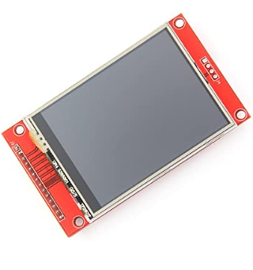
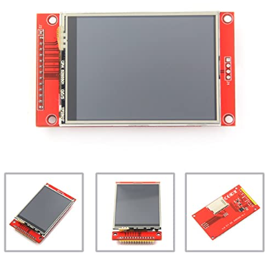

## IL/9341 2.8° TFT-LCD display
### POR: Velasques Salas Ricardo Emmanuel

| datos       | especificaciones      |
|-------------|--------------|
| Color       | Blanco/Rojo  |
| Material    | FR4          | 
| Tamaño      | 2.8          |

### HiLetgo ILI9341 2,8 pulgadas SPI TFT LCD pantalla táctil 240 x 320 con PCB 5 V/3,3 V STM32
$481.23

# *Caracteristicas de IL/9341 2.8° TFT-LCD display.*
<table class="tg">
<tbody>
  <tr>
    <td class="tg-0pky">ste módulo LCD de 2,8 pulgadas utiliza chip de unidad ILI9341 para conducir 240 x 320 puntos, con resolución de 240 x 320, soporta pantalla de color de 65 K, y la pantalla es colorida..</td>
  </tr>
    <tr>
    <td class="tg-0pky">Con placa PCB (incluyendo fuente de alimentación IC, Touch IC, tarjeta SD) compatible con interfaz 5110, se necesita al menos 4 controladores IO (sin tocar), se necesita al menos 9 controladores IO (con toque)..</td>
  </tr>
  <tr>
    <td class="tg-0pky">Soporte de inserción directa MCU, no necesita ninguna conexión.</td>
  </tr>
  <tr>
    <td class="tg-0pky">Sistema de alimentación IC estabilizador integrado, compatible con fuente de alimentación de 5 V o 3,3 V. Compatible con el nivel de E/S de 5 V/3,3 V, compatible con conexiones de E/S MCU.</td>
  </tr>
  
</tbody>
</table>

### Elemento del controlador: matriz activa a-Si TFT
Resolución (puntos): 240RGB*320Dots
Dirección de visualización: 6 en punto
Disposición de píxeles: RGB
Con placa PCB (incluyendo fuente de alimentación IC, SD), compatible con la interfaz 5110

### 2.4" ILI9341 240x320 SPI TFT LCD Display Driver IC: ILI9341, Size:2.4" SPI Serial Type: without touch panel; Display area:36.72(W)X48.96(H)mm Driver element: a-Si TFT active matrix

